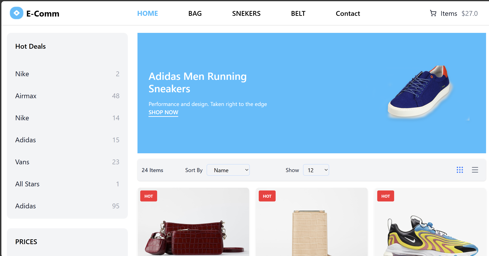

# Ecommerce Assignment Project

-> This is a fully responsive **Ecommerce web application** built as part of an assignment.  
It includes product listing, filters, pagination, and a clean UI with modern styling.

##  Features
-  Reusable components: Navbar, Sidebar, FilterPanel,
   ProductCard, Badge, Rating, Pagination, Footer 
-  Pagination (client-side, state maintained)
-  Product Listing with Grid Layout  
-  Sidebar Filters (Price, Color, Brand)  
-  Pagination for Products  
-  Shop Now Page (All Products with Filters)  
-  Contact Form Page  
-  Responsive UI desktop, tablet, and mobile with Tailwind CSS  

##  Tech Stack
- React.js (Frontend UI framework)
- React Router DOM (Routing, Navigation)
- Tailwind CSS (Styling)
- Mock dataset (Porducts.js)
- Git & GitHub (Version Control)

##  Folder Structure 

- Frontend-Intern-Test
- src/
  > components/ # Reusable components (Navbar, Sidebar,   ProductCard, etc.)
  > data/ # Mock product data
  > Layout/ # MainLayout ( App Main Structure)
  > pages/ # Home page (Product Listing pages )
  > App.jsx # Main app structure
  > index.css # Tailwind setup

##  Screenshots

### 🏠 Home Page

### 🛍️ Shop Now Page
### 📞 Contact Page

##  Installation

*  Clone repo
-  git clone https://github.com/kuldeep-97/Ecommerce-  assignment.git

*  Go inside folder
-  cd Ecommerce-assignment

*  Install dependencies
-  npm install

*  Start development server
-  npm run dev

## Author
* Developed by Kuldeep kumawat
* Frontend Developer Intern Assignment Submission